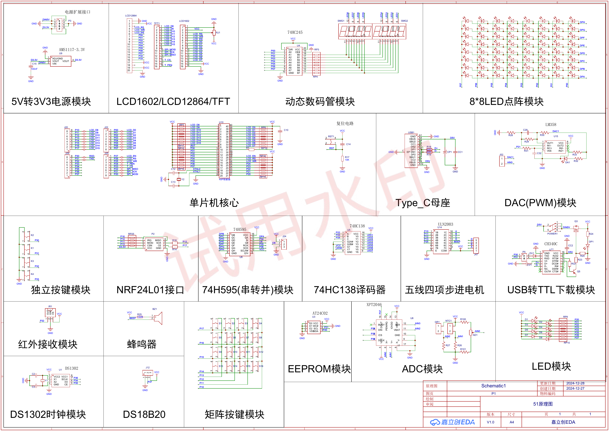

# C51-Board-Lab

51 开天开发板的硬件资源分析与板级实验。仓库围绕端口分配、总线缓冲、片选译码和外设复用组织代码，课程原始工程保存在各项目的 `course/` 中。


## Overview

板上使用 40 引脚 8051 兼容 MCU，课程代码按 11.0592 MHz 编写，Keil 工程以通用 `AT89C52` 目标保存。实验覆盖 LED、数码管、LCD1602、矩阵键盘、LED 点阵、UART、AT24C02、DS1302、XPT2046、软件 PWM 和蜂鸣器。

这里的重点是信号如何从 MCU 到达外设：

```text
Application
    ↓
Driver / Module
    ↓
P0 / P1 / P2 / P3
    ↓
74HC138 / 74HC245 / 74HC595 / on-board interfaces
    ↓
Display / Input / Storage / RTC / ADC / Motor
```

## Hardware Architecture



- `P0` 是主要数据总线，用于数码管段码、LCD 数据和点阵行数据。
- `P2.2~P2.4` 接入 74HC138，产生 8 路低有效选择信号。
- 74HC245 缓冲数码管段码总线。
- `P3.4~P3.6` 同时服务于 74HC595、DS1302 和 XPT2046，不同模块不能无条件同时驱动。
- J24 在数码管和 8×8 点阵之间切换共享资源。
- CH340C 将 MCU 串口连接到 USB。

更完整的板级说明见：

- [开发板架构分析](docs/开发板架构分析.md)
- [MCU 资源分配](docs/MCU资源分配.md)
- [外设连接关系](docs/外设连接关系.md)
- [调试记录](docs/调试记录.md)

## Board Resources

| 类别 | 板载资源 | 关键接口 |
| --- | --- | --- |
| 显示 | 8 位数码管、8×8 LED 点阵、LCD1602/LCD12864 接口 | P0、P2.2~P2.7、P3.4~P3.6 |
| 输入 | 4 个独立按键、4×4 矩阵键盘、红外输入 | P3.0~P3.3、P1、INT0 |
| 通信 | CH340C USB-TTL、NRF24L01 接口 | UART、扩展排针 |
| 存储与时钟 | AT24C02、DS1302 | 软件 I²C、三线串行接口 |
| 模拟与控制 | XPT2046、热敏/光敏/电位器、PWM、电机、蜂鸣器 | P3.4~P3.7、Timer0、ULN2003 |
| 扩展 | DS18B20、TFT、LCD12864 | P3.7、板载排针 |

## Projects

| 分类 | 项目 | 内容 |
| --- | --- | --- |
| GPIO 与基础控制 | [LED control](projects/01_GPIO与基础控制/led-control/) | 端口输出、闪烁和流水灯 |
| GPIO 与基础控制 | [Timer0 periodic interrupt](projects/01_GPIO与基础控制/timer0-periodic/) | 1 ms 周期中断 |
| 显示系统 | [Seven-segment display](projects/02_显示系统/seven-segment/) | 74HC245 段码、74HC138 位选、动态扫描 |
| 显示系统 | [LCD1602](projects/02_显示系统/lcd1602/) | 8 位数据总线和字符显示接口 |
| 显示系统 | [LED matrix](projects/02_显示系统/led-matrix/) | 74HC595 串并转换与扫描显示 |
| 输入系统 | [Independent keys](projects/03_输入系统/independent-keys/) | 独立按键、消抖与模块封装 |
| 输入系统 | [Matrix keypad](projects/03_输入系统/matrix-keypad/) | 4×4 行列扫描 |
| 输入系统 | [Infrared input](projects/03_输入系统/infrared-input/) | INT0 边沿输入基础 |
| 通信与存储 | [UART](projects/04_通信与存储/uart/) | Timer1 波特率、发送和中断接收 |
| 通信与存储 | [AT24C02 EEPROM](projects/04_通信与存储/at24c02-eeprom/) | 软件 I²C 读写 |
| 通信与存储 | [DS1302 RTC](projects/04_通信与存储/ds1302-rtc/) | 三线通信、BCD 时间显示 |
| 外设控制 | [Software PWM](projects/05_外设控制/software-pwm/) | Timer0 比较输出、LED 和电机 |
| 外设控制 | [XPT2046 ADC](projects/05_外设控制/xpt2046-adc/) | 板载模拟通道采样 |
| 外设控制 | [Buzzer](projects/05_外设控制/buzzer/) | 软件方波输出 |
| 综合应用 | [Board factory test](projects/06_综合应用/board-factory-test/) | BSP、矩阵按键和多外设测试入口 |

## Build

1. 使用 Keil C51 打开项目目录中的 `.uvproj`。
2. 检查目标器件、晶振和输出目录；课程定时代码按 11.0592 MHz 计算。
3. 编译后使用 STC-ISP 和板载 CH340C 下载。
4. 数码管或点阵无显示时，先检查 J24 跳线位置。

仓库不跟踪 Keil 的 `Objects/`、`Listings/`、HEX、用户界面状态和构建日志。

## Source Layout

- `course/`：课程提供的原始源码与工程文件，按原字节复制。
- `practice/`：仅在形成个人修正或扩展版本后建立；当前 Phase 2 没有空目录。
- `docs/`：根据原理图和源码整理的板级说明。
- `assets/images/`：从现有资料中筛选的板卡、原理图和接口图，来源见 [SOURCES.md](assets/images/SOURCES.md)。

课程与第三方资料不受根目录 MIT License 覆盖，详见 [THIRD_PARTY_NOTICES.md](THIRD_PARTY_NOTICES.md)。

## Related Repositories

- [stc89c52-learning](https://github.com/REliasCheng/stc89c52-learning)：STC89C52RC 外设驱动与模块化工程。
- [BlueBridgeCup-MCU](https://github.com/REliasCheng/BlueBridgeCup-MCU)：CT107D 竞赛训练与多外设综合控制。
