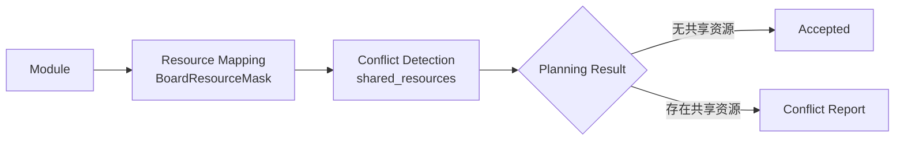

# C51-Board-Lab

面向 8051 兼容教学开发板的板级资源分析与组合工程规划仓库。核心实践 `Board Resource Planner` 把原理图中的端口复用、定时器占用和显示跳线转换为可执行的资源冲突检查，使综合应用在编码前就能发现硬件资源重叠。

## 平台与技术栈

- **处理器范围**：40 引脚 8051 兼容 MCU，代码语境以 `REGX52` / AT89C52 类目标为主
- **典型时钟**：11.0592 MHz，实际使用以板载晶振为准
- **开发方式**：Embedded C / Keil C51；资源规划核心使用 C11 + GCC
- **板级模块**：数码管、LED 点阵、LCD、独立键/矩阵键、UART、AT24C02、DS1302、DS18B20、XPT2046

## 架构说明


```mermaid
flowchart LR
    A["Module"] --> B["Resource Mapping<br/>BoardResourceMask"]
    B --> C["Conflict Detection<br/>shared_resources"]
    C --> D{"Planning Result"}
    D -->|无共享资源| E["Accepted"]
    D -->|存在共享资源| F["Conflict Report"]
```

资源模型采用保守策略：只要两个模块共享同一端口组、定时器或显示模式，就先报告冲突；是否能通过分时复用解决，由具体应用进一步评估。

### 为什么需要资源规划

8051 教学板上的模块并不总是拥有独立引脚。例如 UART 与独立按键共享 P3.0/P3.1，LED 与 AT24C02 共享 P2.0/P2.1。如果只按功能列表组合模块，冲突通常要到联调阶段才暴露。`Board Resource Planner` 先把模块需求映射为 `BoardResourceMask`，再与已选模块逐项比较，让资源重叠在编码前就可见。

### 模块资源需求示例

以下映射均来自当前资源表和现有测试：

| 模块 | 资源需求 | 现有测试中的关系 |
| --- | --- | --- |
| UART | P3.0/P3.1、Timer1 | 与独立按键在 P3.0/P3.1 冲突 |
| 独立按键 | P3.0/P3.1、P3.2 | 与 UART 在 P3.0/P3.1 冲突 |
| LED | P2.0/P2.1、P2.2~P2.4、P2.5~P2.7 | 与 AT24C02 在 P2.0/P2.1 冲突 |
| AT24C02 | P2.0/P2.1 | 与 LED 在 P2.0/P2.1 冲突 |
| 数码管 + UART + Timer0 Tick | 各自资源无重叠 | 现有测试接受该三模块组合 |

冲突检测返回新加入模块、已有模块和共享资源位图；它只报告静态占用关系，不判断分时复用或电气兼容性。

## 核心功能

- 建立 P0 数据总线、P2 控制线、P3 串行外设与 UART 的复用表。
- 识别数码管、点阵和 LCD 之间的显示资源冲突。
- 检查独立按键与 UART、AT24C02 与 LED、DS1302 与 XPT2046 等组合。
- 通过位图表达模块占用，输出冲突资源和相关模块。
- 用主机端测试覆盖六组已知冲突和一组兼容组合。

## 工程结构

```text
projects/06_综合应用/board-resource-planner/
  practice/include/board_resources.h  资源与结果接口
  practice/src/board_resources.c      板级资源表和冲突检查
  practice/src/main.c                 组合规划示例
  tests/test_board_resources.c        主机端验证
docs/                                 板卡、外设、资源与调试说明
```

### 核心入口

| 内容 | 文件 |
| --- | --- |
| 资源定义与结果接口 | [`board_resources.h`](projects/06_综合应用/board-resource-planner/practice/include/board_resources.h) |
| 模块映射与冲突检测实现 | [`board_resources.c`](projects/06_综合应用/board-resource-planner/practice/src/board_resources.c) |
| 已有兼容/冲突测试 | [`test_board_resources.c`](projects/06_综合应用/board-resource-planner/tests/test_board_resources.c) |
| 项目说明与构建命令 | [`Board Resource Planner README`](projects/06_综合应用/board-resource-planner/README.md) |

## 文档导航

- [开发板架构分析](docs/开发板架构分析.md)
- [外设连接关系](docs/外设连接关系.md)
- [MCU 资源分配](docs/MCU资源分配.md)
- [个人实践路线](docs/个人实践路线.md)
- [Board Resource Planner](projects/06_综合应用/board-resource-planner/README.md)

## 验证范围

资源规划器及其测试已使用 GCC 16.1.0、C11 与 `-Wall -Wextra -Werror -pedantic` 构建并运行通过。

验证对象是静态资源模型，不替代 Keil 目标构建、跳线检查、电气兼容性分析或真实开发板测试；板级结论仍需结合具体板卡版本和原理图复核。

## License Boundary

根目录 [MIT License](LICENSE) 适用于仓库维护者编写的代码与文档。芯片手册、板卡图纸、器件资料以及未随仓库分发的外部实现不因技术引用而纳入该许可。
