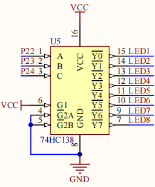
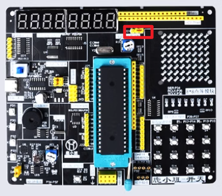
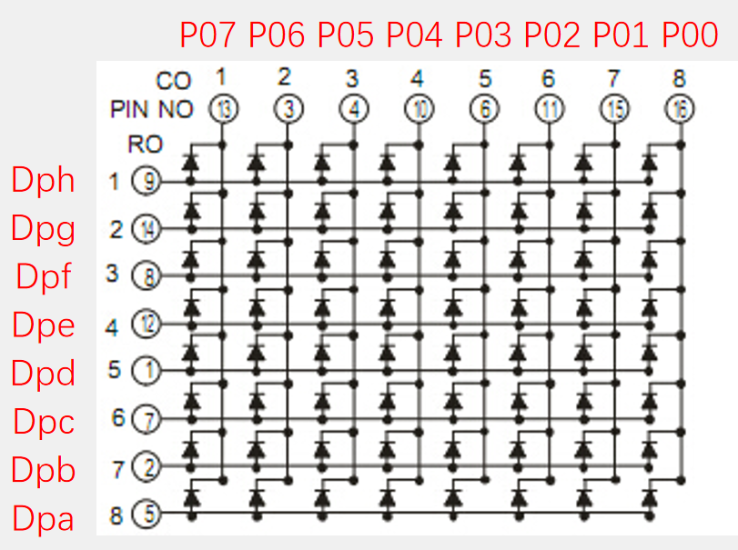

# 外设连接关系

## 数码管：74HC245 与 74HC138

P0 输出 `a~g` 和小数点段码，74HC245 提供总线缓冲。P2.2、P2.3、P2.4 作为 74HC138 的三位地址输入，译码后选择 8 个显示位。

动态显示按照“关闭段码 → 选择位 → 写入段码 → 延时”的顺序轮询。课程模块版在位切换时清空 P0，用于减轻重影。

## 数码管与点阵跳线

数码管和 8×8 点阵共享显示资源。J24 靠数码管侧时数码管有效，靠点阵侧时点阵有效。显示异常时应先核对跳线，再检查代码。

## LED 点阵与 74HC595

74HC595 使用 `SER=P3.4`、`RCK=P3.5`、`SCK=P3.6` 完成串并转换和输出锁存。驱动先移入列数据，再通过锁存时钟更新输出，配合 P0 完成行列扫描。

## AT24C02

AT24C02 使用 `SCL=P2.1`、`SDA=P2.0`。课程驱动以 GPIO 模拟 I²C，包含 START、STOP、字节读写和 ACK/NACK 时序。

## DS1302

DS1302 使用 `SCLK=P3.6`、`IO=P3.4`、`CE=P3.5`。寄存器数据采用 BCD，应用层转换后送入 LCD1602。

## XPT2046

XPT2046 使用 `CS=P3.5`、`DCLK=P3.6`、`DIN=P3.4`、`DOUT=P3.7`。MCU 发送控制字选择输入通道，再按时钟读取 12 位转换结果。

