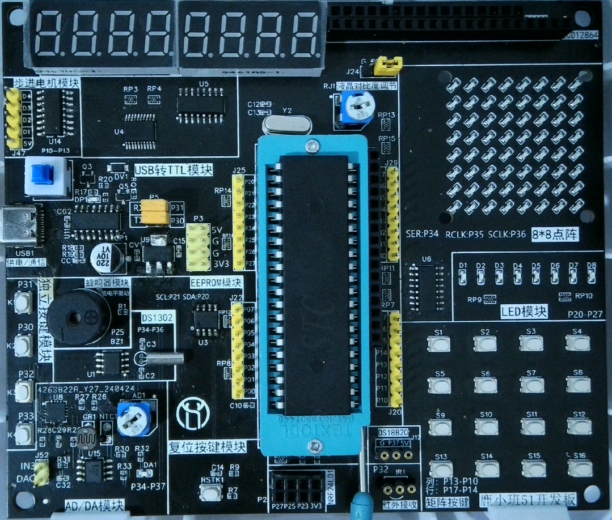

# 开发板架构分析

## 处理器与供电

开发板使用 40 引脚 8051 兼容 MCU 插座。课程源码使用 `REGX52.H`，定时和串口参数按 11.0592 MHz 编写；Keil 工程文件则保存为通用 `AT89C52` 目标。板上由 5 V 供电，并通过 AMS1117 提供 3.3 V 扩展电源。



## 板级数据路径

```text
P0 ──> 74HC245 ──> 数码管段线
 │
 ├──────────────> LCD1602 / LCD12864 数据总线
 │
 └──────────────> 8×8 点阵行数据

P2.2~P2.4 ──> 74HC138 ──> 数码管位选

P3.4~P3.6 ──> 74HC595 / DS1302 / XPT2046
```

P0 和 P3.4~P3.6 都不是某个外设的专用接口。单模块工程可以直接占用端口，综合工程必须先决定当前激活的硬件，再驱动对应总线。

## 显示资源

- 数码管：P0 输出段码，74HC138 选择 8 个显示位；
- LED 点阵：74HC595 提供串行扩展，P0 参与行列扫描；
- LCD1602/LCD12864：P0 为 8 位数据口，P2.5~P2.7 为控制口；
- J24：在数码管和点阵共享资源之间切换。

## 输入和通信

- 四个独立按键接 P3.0~P3.3，其中 P3.0/P3.1 同时是 UART；
- 4×4 矩阵键盘占用整个 P1；
- CH340C 把 P3.0/P3.1 的 UART 转换为 USB；
- 红外接收使用 INT0/P3.2；
- DS18B20 接口使用 P3.7。

## 模拟与执行器

XPT2046 连接热敏、光敏和电位器输入；软件通过 P3.4~P3.7 发送控制字并读取 12 位结果。ULN2003 提供电机等负载的电流驱动，蜂鸣器控制信号位于 P2.5。
