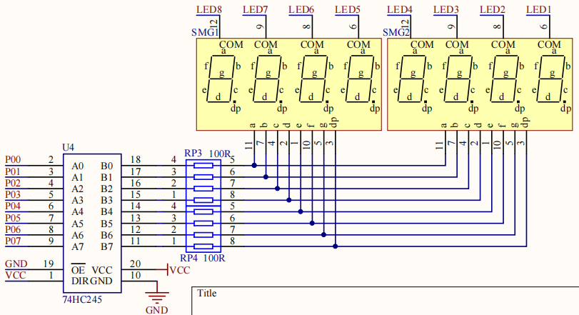

# 七段数码管

数码管项目把 8 位显示拆成两条硬件路径：P0 传输段码，P2.2~P2.4 选择显示位置。`course/` 包含直接驱动、动态扫描和模块封装三个版本。

## Hardware Overview

| 部件 | 接口 | 作用 |
| --- | --- | --- |
| 8051 MCU | P0 | 输出 `a~g` 和 `dp` 段码 |
| 74HC245 | P0 与段线之间 | 缓冲 8 位数据总线 |
| 74HC138 | P2.2、P2.3、P2.4 | 把三位选择码译成八路位选 |
| J24 | 显示资源跳线 | 在数码管和 8×8 点阵之间选择 |

74HC245 不保存数据，它负责总线隔离和驱动；数码管持续显示依赖 MCU 周期刷新。




## Signal Flow

```text
number
  ↓ segment lookup table
P0 byte ──> 74HC245 ──> a~g / dp

position
  ↓ three-bit select code
P2.2~P2.4 ──> 74HC138 ──> one active digit
```

多位动态显示按固定节拍切换位选。人眼看到的是连续画面，任一时刻实际只有一位处于选通状态。

## Software Structure

```text
main.c
  └─ Nixie_Disp(loc, val)
       ├─ select one digit through P2.2~P2.4
       ├─ map val through Disp_Val[]
       ├─ write segment byte to P0
       └─ blank P0 before next position
```

- `course/01_driver/`：单个位选和段码输出；
- `course/02_dynamic-scan/`：在 `main.c` 中轮询多位；
- `course/03_module/`：把显示动作封装到 `Nixie.c/.h`。

## Key Implementation

`Nixie_Disp()` 使用 `switch` 把 1~8 映射到 P2.4/P2.3/P2.2 的组合，再由 `Disp_Val[]` 查找段码。显示 1 ms 后写 `P0=0x00`，防止上一位段码残留到下一位。

当前实现用阻塞延时控制刷新节拍。Timer0 固定扫描方案将刷新与应用逻辑分离，应用层只维护 8 字节显示缓冲区。

## Engineering Value

该模块使用译码器减少位选 GPIO、使用缓冲器隔离显示负载，并通过时间复用驱动多位显示。P0 数据总线与 P2 选择控制在此形成两条独立信号路径。

## Debug Record

- 全部不亮：先检查 J24 是否位于数码管侧；
- 只亮固定一位：检查 P2.2~P2.4 和 74HC138 输出；
- 段码错误：检查 P0、74HC245 方向及 `Disp_Val[]`；
- 重影：确认切换位选前后是否执行消隐。

## Source

工程入口：`course/`。
