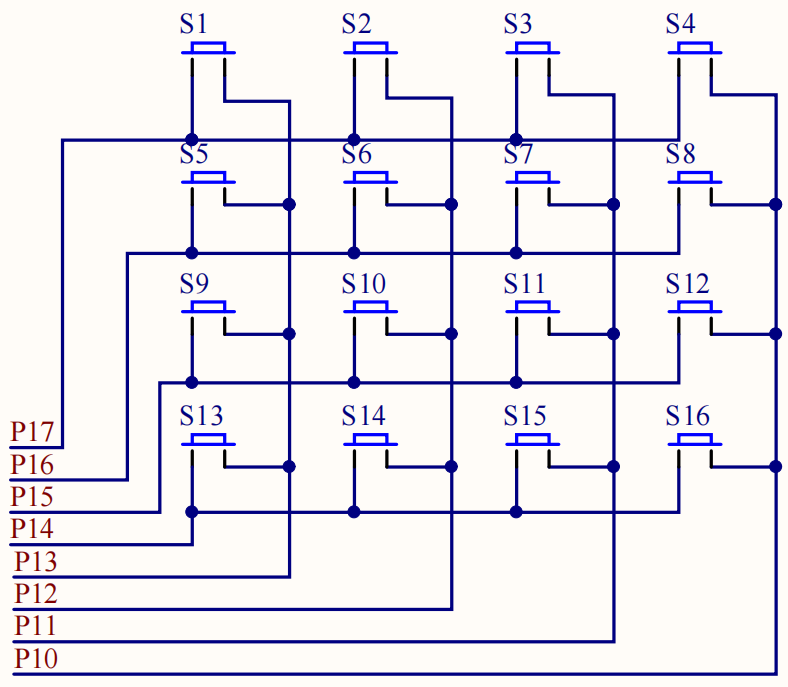

# 4×4 矩阵键盘

## 功能介绍

扫描 16 个矩阵按键，并把键值显示在 LCD1602 上。

## 硬件结构

```text
P1.3~P1.0 ──> row drive
P1.7~P1.4 <── column sense
```



## 软件结构

`MatrixKey.c` 负责行列扫描和键值转换，`LCD1602.c` 输出结果，`main.c` 组合两个模块。

## 关键代码

扫描函数先改变一组行列电平，再读取另一组输入，通过行号与列号组合出 1~16 的键值。课程版同样使用延时消抖和等待释放。

## 调试记录

P1 同时连接步进电机/扩展接口。扫描时会周期改变整个端口，高电流外设或外部模块接入前需要确认不会被误驱动。

## 技术总结

矩阵连接把 16 个按键压缩到 8 根信号线，代价是软件必须管理扫描方向、消抖和键值映射。

## Source

`course/matrix-scan/` 为课程原始工程。
