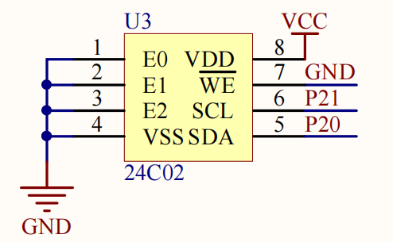

# AT24C02 EEPROM

软件 I²C 驱动通过 P2.0/P2.1 访问 AT24C02。示例从地址 0 读取计数值，修改后写回，并在 LCD1602 上显示。

## Hardware Overview

| 信号 | MCU 引脚 | 方向 |
| --- | --- | --- |
| SDA | P2.0 | 双向数据 |
| SCL | P2.1 | MCU 输出时钟 |
| E0~E2 | GND | 固定器件地址 |



P2.0/P2.1 也是 LED 端口。I²C 传输期间对应 LED 可能随总线电平变化。

## Signal Flow

```text
application counter
        ↓
AT24C02_ReadByte / WriteByte
        ↓
START → device address → memory address → data → ACK → STOP
        ↓
P2.0 SDA / P2.1 SCL
        ↓
AT24C02 non-volatile memory
```

随机读取先以写方向发送存储地址，再产生重复 START，以读方向取回一个字节。

## Software Structure

```text
main.c
  ├─ LCD1602 driver
  └─ AT24C02 byte API
       └─ software I2C primitives
            ├─ I2C_Start / Stop
            ├─ I2C_SendByte / ReceiveByte
            └─ I2C_SendAck / ReceiveAck
```

当前课程代码把 I²C 基础时序和 AT24C02 器件接口放在同一个 `i2c.c` 中。

## Key Implementation

`AT24C02_WriteByte()` 依次发送 `0xA0`、存储地址和数据，然后固定等待 5 ms。`AT24C02_ReadByte()` 使用 `0xA0` 设置地址，再用 `0xA1` 读取，并以 NACK 结束单字节传输。

代码调用 `I2C_ReceiveAck()` 但没有检查返回结果，因此总线断开、地址错误和器件忙不会反馈到应用层。个人版本计划增加错误返回、超时和 ACK polling。

## Engineering Value

该模块展示了从 GPIO 边沿到 I²C 事务，再到非易失字节存储的分层关系。接口改进重点不是增加更多 API，而是让错误能从总线层返回应用层。

## Debug Record

- 读回值不变：检查 SDA/SCL 接线、器件地址和写周期；
- 上电后数据异常：区分未初始化存储与通信失败；
- 总线一直为低：检查 SDA 释放和异常事务后的 STOP；
- LED 闪烁：属于 P2.0/P2.1 复用产生的可见总线活动。

## Source

`course/software-i2c/` 为课程原始工程。
