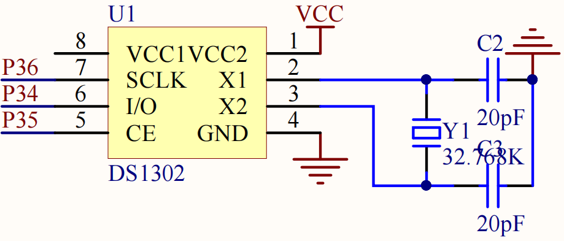

# DS1302 RTC

DS1302 项目包含三线字节读写和 LCD1602 时间显示两个版本。驱动把寄存器访问、BCD 编码和显示数据连接成完整的 RTC 路径。

## Hardware Overview

| 信号 | MCU 引脚 | 作用 |
| --- | --- | --- |
| SCLK | P3.6 | 串行时钟 |
| I/O | P3.4 | 双向数据，低位先传输 |
| CE | P3.5 | 事务使能 |
| X1/X2 | 32.768 kHz 晶振 | RTC 时间基准 |



P3.4~P3.6 还连接 74HC595 和 XPT2046，综合应用必须对三类驱动进行互斥管理。

## Signal Flow

```text
time array (decimal)
        ↓ SetTime: decimal → BCD
DS1302_WriteByte(command, data)
        ↓ CE / SCLK / I/O
DS1302 registers
        ↓ DS1302_ReadByte
GetTime: BCD → decimal
        ↓
LCD1602 date and time
```

## Software Structure

```text
main.c
  ├─ LCD_Init()
  ├─ DS1302_Init()
  ├─ SetTime()
  └─ loop
       ├─ GetTime()
       └─ LCD_ShowNum / LCD_ShowChar

ds1302.c
  ├─ byte-level three-wire transfer
  ├─ register command definitions
  └─ decimal/BCD conversion
```

## Key Implementation

命令和数据按 bit0 到 bit7 的顺序传输。读命令通过 `cmd|=0x01` 从写地址切换到对应读地址；`GetTime()` 把寄存器中的 BCD 高低半字节还原为十进制。

课程第二版存在两个需要在个人版本处理的问题：

1. `DS1302_WP` 定义为 `0x8`，与写保护寄存器的完整命令地址格式不一致；
2. `main()` 每次启动都调用 `SetTime()`，会覆盖 RTC 当前时间。

`course/` 保留原始写法；修正将进入独立 `practice/`。

## Engineering Value

RTC 工程把串行总线、寄存器地址、BCD 数据格式和应用显示连在一起。初始化策略说明“驱动能写寄存器”和“系统能长期维护时间”是两个不同问题。

## Debug Record

- 时间不走：检查 32.768 kHz 晶振、CE/SCLK/I/O 和写保护状态；
- 每次复位回到同一时间：检查启动流程中的 `SetTime()`；
- 数字显示错误：分别核对 BCD 转换和 LCD 格式；
- 与点阵/ADC 同时使用异常：检查 P3.4~P3.6 复用冲突。

## Source

`course/01_driver/` 和 `course/02_clock-display/` 为课程原始工程，源码未修改。
