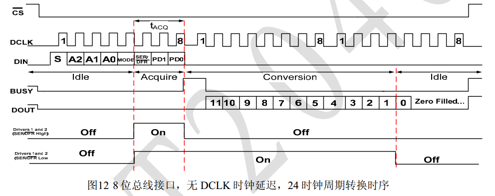

# XPT2046 ADC

## 功能介绍

读取 XPT2046 的 XP、YP 和 VBAT 通道，并把 12 位结果显示在 LCD1602 上。板载通道连接电位器、光敏和热敏输入。

## 硬件结构

```text
P3.5 ──> CS
P3.6 ──> DCLK
P3.4 ──> DIN
P3.7 <── DOUT
         XPT2046 ──> analog channels
```



## 软件结构

`XPT2046.c` 负责控制字发送和 12 位结果读取，`main.c` 依次选择通道并调用 LCD1602 驱动显示。

## 关键代码

驱动先拉低 CS，再按高位在前发送 8 位控制字，随后在 DCLK 边沿采样 DOUT。读取结果右移对齐后得到 12 位 ADC 值。

## 调试记录

这不是 MCU 内置 ADC；采样由外部 XPT2046 完成。P3.4~P3.7 与 DS1302、74HC595 和 DS18B20 复用，综合项目必须避免并发访问。

## 技术总结

该工程展示了外部 ADC 的命令选择、同步串行时序和模拟量到显示数据的转换链路。

## Source

`course/xpt2046-read/` 为课程原始工程。
